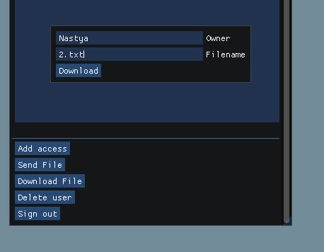

# Note

## Описание

Этот проект представляет собой инструмент для обмена файлами  

## Установка

### Требования и необходимые библиотеки

* C++ 20 
* crypto++
* libpqxx
* boost
* glfw
* imgui

### Инсталяция

1. Клонируйте репозиторий: https://github.com/fmadd/Note.git
2. Убедитесь что у вас установлены все необходимые зависимости 
2. В папке build выполните сборку клиентской части проекта (Note/build)
3. При необходимости выполните сборку серверной части проекта (NoteServer/build)

## Пользовательские сценарии
Общий интерфейс

* Регистрация:

В окне Sing up необходимо ввести пароль и уникальный логин для того что бы создать пользователя

* Авторизация

В окне Sing in необходимо ввести пароль и логин для входа в свой аккаунт

* Отправка файла на сервер

В окне Send необходимо ввести логин владельца файла и название файла, файл будет обновлен на сервере

* Загрузка файла с сервера

В окне download необходимо ввести логин владельца файла и название файла, файл будет будет помещен в папку userfiles в том состоянии, которое сейчас на сервере. В процессе редактирования файла одим клиентом, он будет недоступен для скачивания другим.

* Добавление пользователя для совместного редактирования вашего файла 

Необходимо ввести название файла и пользователя, которому хотите выдать права.

* Выход из аккаунта

Для выхода из аккаунта необходимо нажать Sing out

* Удаление аккаунта

Пользователь может удалить свой аккаунт при нажатии Delete user